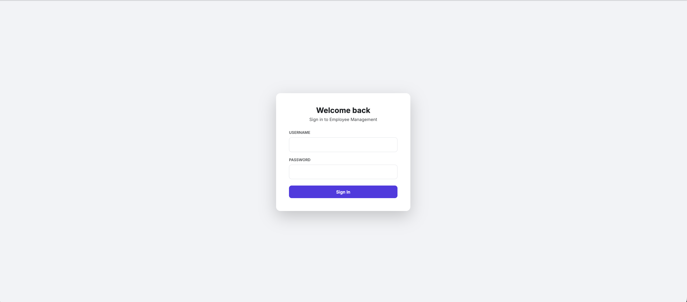
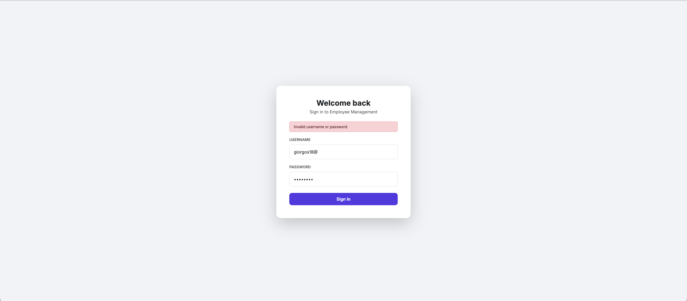
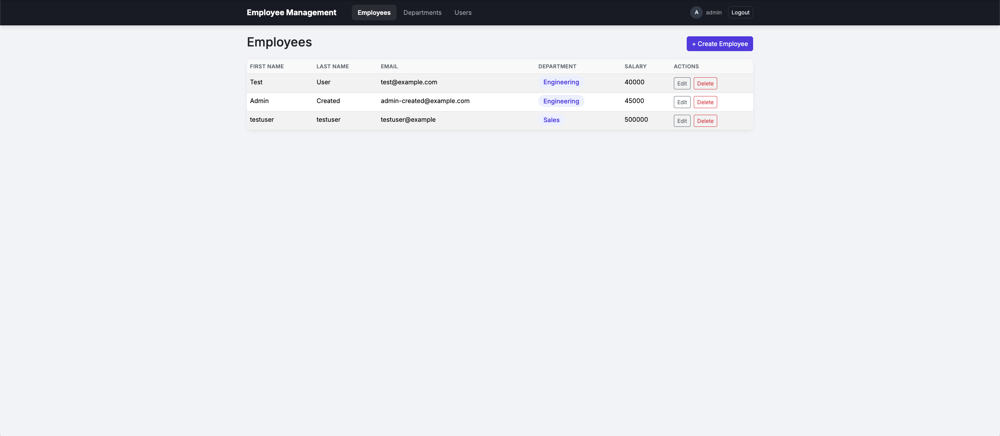
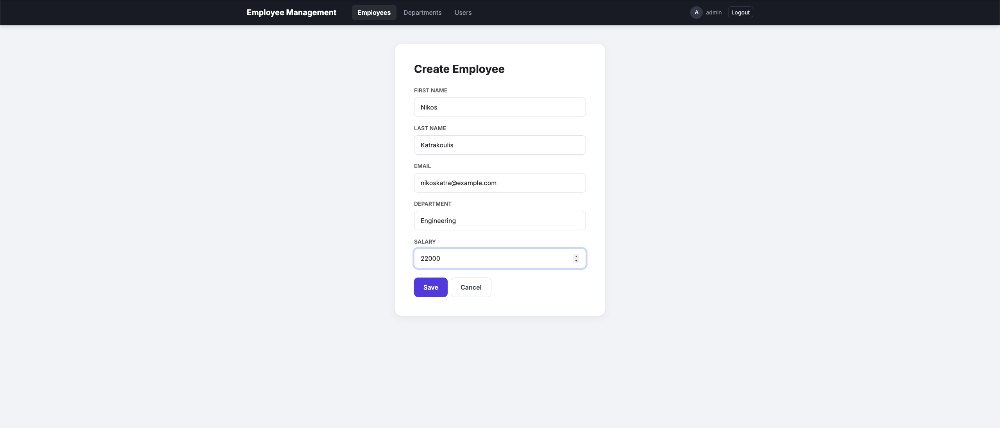
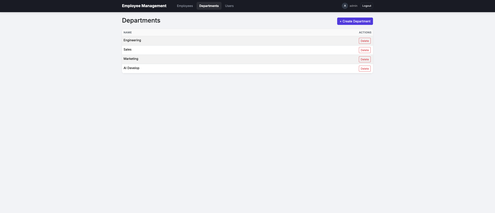
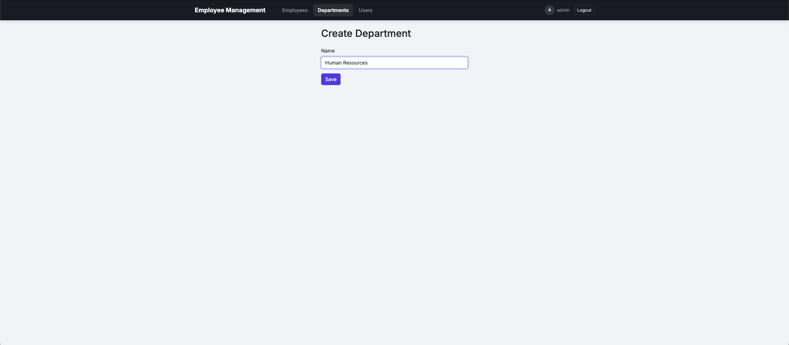
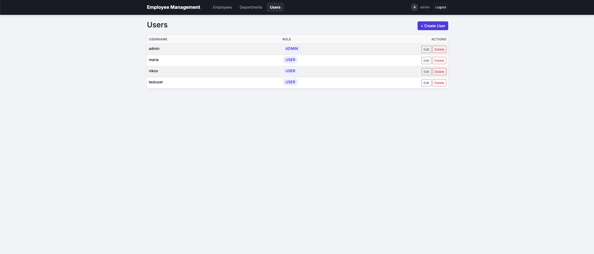
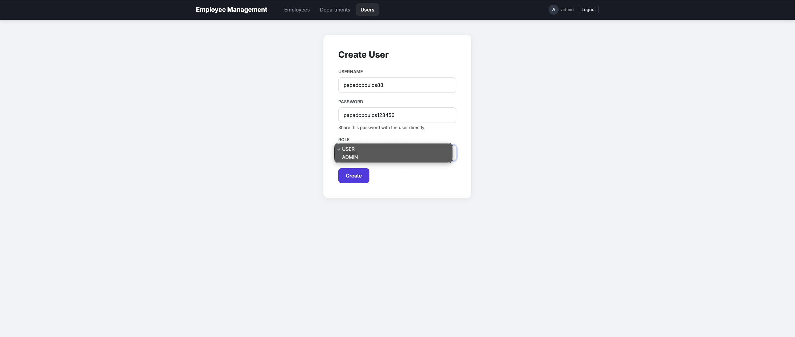
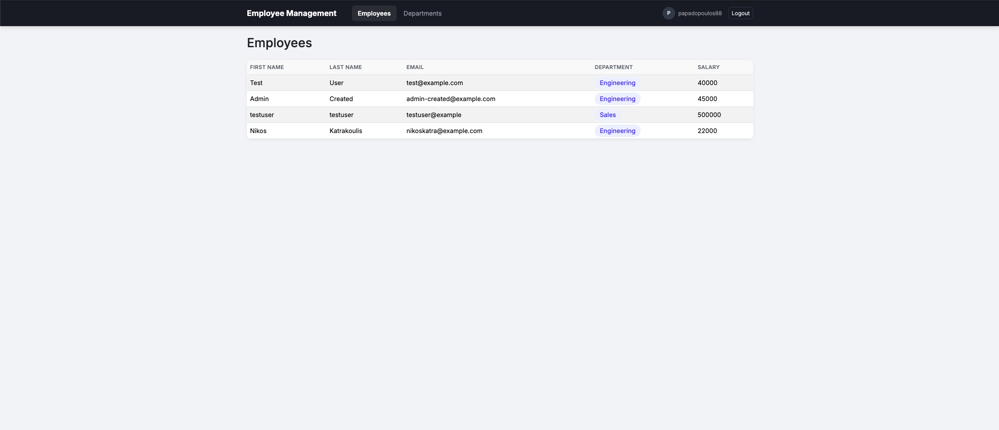
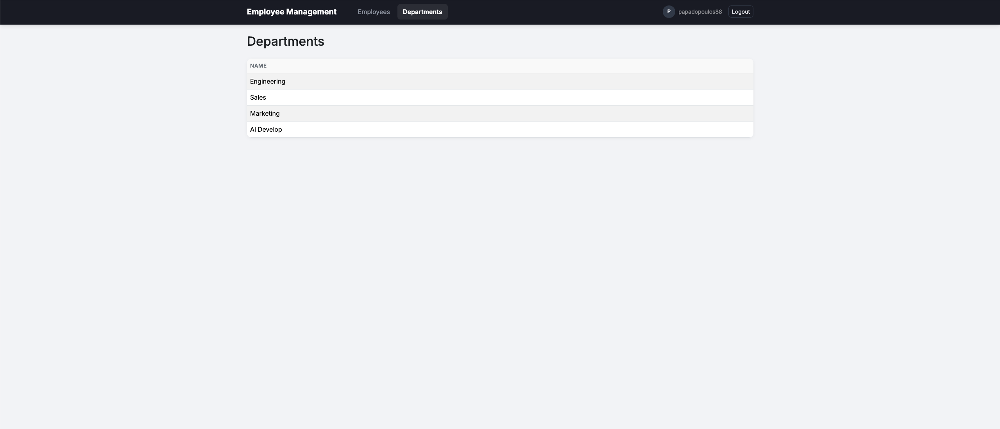

<div align="center">

# 👥 Employee Management API

**A full-stack Employee Management platform for managing employees, departments and user accounts, with JWT-secured role-based access.**

Spring Boot · PostgreSQL · React · JWT Authentication

[](https://www.oracle.com/java/)
[](https://spring.io/projects/spring-boot)
[](https://react.dev/)
[](https://vitejs.dev/)
[](https://www.postgresql.org/)
[](https://flywaydb.org/)
[](https://www.docker.com/)
[](#-license)

</div>

---

## 🖼️ Screenshots

<p align="center"><i>All screens below are pulled directly from <code>/assets</code>.</i></p>
<p align="center"><a href="#-overview">Jump to full documentation ↓</a></p>

### 🔑 Authentication

<table>
<tr>
<td width="50%" align="center">
<a href="assets/01-login-page.png"></a>
<br/><sub><b>Login screen</b> — JWT-based sign-in for both employees and admins</sub>
</td>
<td width="50%" align="center">
<a href="assets/02-login-page-invalid-username-or-password.png"></a>
<br/><sub><b>Invalid credentials</b> — clear error feedback on failed login</sub>
</td>
</tr>
</table>

### 🛠️ Admin — Employee Management

<table>
<tr>
<td width="50%" align="center">
<a href="assets/03-employees-page.png"></a>
<br/><sub><b>Employees list</b> — full CRUD access with Edit/Delete actions</sub>
</td>
<td width="50%" align="center">
<a href="assets/04-create-employee.png"></a>
<br/><sub><b>Creating an employee</b> — name, email, department and salary</sub>
</td>
</tr>
</table>

### 🛠️ Admin — Department Management

<table>
<tr>
<td width="50%" align="center">
<a href="assets/05-departments-page.png"></a>
<br/><sub><b>Departments list</b> — create and delete departments</sub>
</td>
<td width="50%" align="center">
<a href="assets/06-create-department.png"></a>
<br/><sub><b>Creating a department</b></sub>
</td>
</tr>
</table>

### 🛠️ Admin — User Management

<table>
<tr>
<td width="50%" align="center">
<a href="assets/07-user-page.png"></a>
<br/><sub><b>Users list</b> — manage system accounts and roles</sub>
</td>
<td width="50%" align="center">
<a href="assets/08-create-user.png"></a>
<br/><sub><b>Creating a user</b> — username, password and role assignment</sub>
</td>
</tr>
</table>

### 👤 Employee (USER role) Experience

<table>
<tr>
<td width="50%" align="center">
<a href="assets/09-user-employees-page.png"></a>
<br/><sub><b>Employees list (read-only)</b> — no create/edit/delete actions for a USER account</sub>
</td>
<td width="50%" align="center">
<a href="assets/10-user-departments-page.png"></a>
<br/><sub><b>Departments list (read-only)</b></sub>
</td>
</tr>
</table>

---

## 📖 Overview

**Employee Management API** is an internal HR style tool built to solve a concrete problem: how do you securely manage a company's employees, departments and system users, keep sensitive data protected and give the right people the right level of access?

The system is split into two independently deployable pieces that talk to each other over a REST API:

- A **Spring Boot backend** exposing a secured REST API, backed by **PostgreSQL** with version-controlled schema migrations (**Flyway**), handling authentication, employee/department CRUD and user administration.
- A **React (Vite) frontend**, a single-page app consuming the API via JWT, with role-aware UI — `ADMIN` users can manage everything, while `USER` accounts get read-only access.

A second, server-rendered **Thymeleaf UI** is also included in the same backend, as an earlier iteration built before the React frontend, using session based form login.

Everything above and below, every screen, every endpoint, every table reflects what is actually implemented in this repository.

---

## 🧑‍🤝‍🧑 Roles & Permissions

Authorization is role-based and enforced via Spring Security using a JWT bearer token. Every authenticated request carries a `ROLE_USER` or `ROLE_ADMIN` authority resolved from the `app_user.role` column.

| Role | Can do |
|---|---|
| 👤 **USER** | Log in · view the list of employees · view a single employee · view the list of departments |
| 🛠️ **ADMIN** | Everything a USER can do, **plus**: create/update/delete employees · create/update/delete departments · create/update/delete user accounts and assign roles |

---

## ✨ Features

### 🔐 Authentication & Security
- Stateless **JWT authentication** (`io.jsonwebtoken` / `jjwt`) login returns a signed access token consumed on every subsequent request via an `Authorization: Bearer <token>` header.
- Custom `OncePerRequestFilter` (`JwtAuthenticationFilter`) validates the token and populates the Spring Security context on every request.
- Passwords are hashed with `BCryptPasswordEncoder` never stored or compared in plaintext.
- **Role-based access control** enforced both in Spring Security (`hasRole("ADMIN")`) and in the React UI (protected routes + conditional rendering).
- CORS configured explicitly for the React dev/build origins.

### 👔 Employee Management
- Full CRUD on **employees** (first name, last name, email, salary, department).
- Each employee belongs to exactly one **department**, modeled as a `@ManyToOne` JPA relationship.
- Validated with Bean Validation (`@NotBlank`, `@Email`, `@Positive`, etc.), with structured `400` responses listing every failed field.

### 🏢 Department Management
- Full CRUD on **departments**, referenced by employees.
- Creating/deleting departments is restricted to `ADMIN` accounts.

### 👥 User Management (Admin)
- Create new user accounts (username, password, role).
- Update a user's username/role, with an **optional** password field leave it blank to keep the current password.
- Delete user accounts.
- A seed migration provisions the very first `admin` account, solving the "who creates the first admin?" bootstrap problem.

### 🗃️ Data & Documentation
- **Database-driven schema** versioned, incremental **Flyway migrations** (departments, employees, users, admin seed).
- **Interactive, always up-to-date API documentation** via **Swagger / OpenAPI** (springdoc), including a "bearer" auth scheme for testing protected endpoints directly from the browser.
- **Unit tests** (JUnit 5 + Mockito) covering service-layer logic.
- **Integration tests** (Testcontainers) spinning up a real, disposable PostgreSQL instance per test run, exercising the full HTTP stack via `MockMvc`.
- **Docker Compose** file to spin up the database, backend and frontend together with a single command.

---

## 🏗️ Tech Stack

| Layer | Technology |
|---|---|
| **Language** | Java 21 |
| **Backend framework** | Spring Boot 4.1.0 (Web, Data JPA, Security, Validation) |
| **Database** | PostgreSQL 16 |
| **Migrations** | Flyway (`flyway-core` + `flyway-database-postgresql`) |
| **Auth** | JWT (`jjwt-api` / `jjwt-impl` / `jjwt-jackson` 0.13.0) |
| **Object mapping** | Lombok, manual DTO ↔ entity mapping in the service layer |
| **API docs** | springdoc-openapi-starter-webmvc-ui 3.1.0 (Swagger UI) |
| **Testing** | JUnit 5, Mockito, Testcontainers |
| **Frontend framework** | React 19 |
| **Routing** | React Router DOM |
| **Build tool** | Vite |
| **HTTP client** | Axios |
| **UI styling** | Bootstrap 5 |
| **Containerization** | Docker / Docker Compose (multi-stage builds, backend + frontend + database) |

---

## 📁 Project Structure

```
employee-management-api/
├── assets/                        # README screenshots
├── src/main/java/com/nikoskatrakoulis/employeemanagementapi/
│   ├── config/                    # SecurityConfig, OpenApiConfig
│   ├── controller/                 # EmployeeController, DepartmentController, UserController, AuthController, WebController
│   ├── dto/                       # Request/response DTOs + validation
│   ├── exception/                 # Custom exceptions + GlobalExceptionHandler
│   ├── model/                      # JPA entities (Employee, Department, AppUser, Role)
│   ├── repository/                 # Spring Data JPA repositories
│   ├── security/                   # JwtService, JwtAuthenticationFilter, CustomUserDetailService
│   └── service/                    # EmployeeService, DepartmentService, UserService
├── src/main/resources/
│   ├── application.properties
│   ├── db/migration/               # V1...V4 Flyway SQL migrations
│   └── templates/                  # Thymeleaf views (legacy UI)
├── src/test/java/                  # Unit + integration tests
├── frontend/                       # React (Vite) SPA
│   ├── src/
│   │   ├── api/                    # Axios client with JWT interceptor
│   │   ├── context/                # AuthContext (login/logout/session)
│   │   ├── pages/                  # LoginPage, EmployeesPage, DepartmentsPage, UsersPage, forms
│   │   ├── components/             # Navbar
│   │   ├── App.jsx
│   │   └── main.jsx
│   ├── Dockerfile
│   └── package.json
├── Dockerfile                      # Backend image (multi-stage Maven build)
├── docker-compose.yaml             # Orchestrates backend + frontend + database
└── pom.xml
```

---

## 🚀 Getting Started

### Option A: Run everything with Docker (recommended)

**Prerequisites:** [Docker](https://www.docker.com/) & Docker Compose

```bash
git clone https://github.com/NikosKatrakoulis/employee-management-api.git
cd employee-management-api
cp .env.example .env   # fill in your own values
docker-compose up --build
```

This builds and starts the PostgreSQL database, the Spring Boot backend, and the React frontend together.

| Service | URL |
|---|---|
| React frontend | http://localhost:3000 |
| Backend API | http://localhost:8080 |
| Swagger UI | http://localhost:8080/swagger-ui.html |

### Option B: Run locally without Docker

**Prerequisites:**
- [Java 21+](https://adoptium.net/)
- [Node.js 18+](https://nodejs.org/) and npm
- [Docker](https://www.docker.com/) (for the database only)

**1. Start the database**
```bash
docker-compose up postgres -d
```

**2. Set environment variables** (see below), then run the backend
```bash
./mvnw spring-boot:run
```

Flyway automatically applies all migrations on startup, including a seed migration for the first `admin` account.

**3. Run the frontend**
```bash
cd frontend
npm install
npm run dev
```

The React app runs at `http://localhost:5173` (Vite's default dev port).

### Environment Variables

Copy `.env.example` to `.env` and set your own values:

```
DB_USERNAME=your_db_username
DB_PASSWORD=your_db_password
JWT_SECRET=your_jwt_secret_here
```

> ⚠️ Never commit real secrets. `.env` is git-ignored; `.env.example` only holds placeholders.

---

## 🔌 API Reference

All endpoints are prefixed with `/api`. Every route **except `/api/auth/login`** and `GET` requests on employees/departments requires a valid `Authorization: Bearer <jwt>` header. Routes annotated *(admin)* additionally require the `ADMIN` role.

### Auth

| Method | Endpoint | Description |
|---|---|---|
| `POST` | `/api/auth/login` | Authenticate with `username` + `password`, returns a JWT `token`, `username`, `role` |

### Employees

| Method | Endpoint | Description |
|---|---|---|
| `GET` | `/api/employees` | List all employees |
| `GET` | `/api/employees/{id}` | Get a single employee |
| `POST` | `/api/employees` | Create an employee *(admin)* |
| `PUT` | `/api/employees/{id}` | Update an employee *(admin)* |
| `DELETE` | `/api/employees/{id}` | Delete an employee *(admin)* |

### Departments

| Method | Endpoint | Description |
|---|---|---|
| `GET` | `/api/departments` | List all departments |
| `GET` | `/api/departments/{id}` | Get a single department |
| `POST` | `/api/departments` | Create a department *(admin)* |
| `PUT` | `/api/departments/{id}` | Update a department *(admin)* |
| `DELETE` | `/api/departments/{id}` | Delete a department *(admin)* |

### Users

| Method | Endpoint | Description |
|---|---|---|
| `GET` | `/api/users` | List all users *(admin)* |
| `GET` | `/api/users/{id}` | Get a single user *(admin)* |
| `POST` | `/api/users` | Create a user *(admin)* |
| `PUT` | `/api/users/{id}` | Update a user — password optional *(admin)* |
| `DELETE` | `/api/users/{id}` | Delete a user *(admin)* |

> 💡 For request/response schemas and to try endpoints live, run the backend and open **Swagger UI** at `/swagger-ui.html`.

---

## 🗄️ Database Schema & Migrations

The schema is entirely managed by **Flyway**, with every change tracked as an incremental, immutable migration in `src/main/resources/db/migration`:

| Migration | Purpose |
|---|---|
| `V1__create_departments_table.sql` | Base `departments` table |
| `V2__create_employees_table.sql` | `employees` table, with a foreign key to `departments` |
| `V3__create_app_user_table.sql` | `app_user` table for authentication |
| `V4__seed_admin_user.sql` | Seeds the first `admin` account, solving the bootstrap problem |

**Core entities:** `Employee`, `Department`, `AppUser` (`Role` enum: `USER` / `ADMIN`).

---

## 🧪 Testing

```bash
./mvnw test
```

- **Unit tests** mock the repository layer with Mockito to test service logic in isolation.
- **Integration tests** use **Testcontainers** to spin up a real, disposable PostgreSQL instance and exercise the full stack which including Flyway migrations, Spring Security, and JWT via `MockMvc`. Docker must be running for these to work.

---

## 🤝 Contributing

Contributions are welcome! To contribute:

1. Fork the repository
2. Create a feature branch (`git checkout -b feature/amazing-feature`)
3. Commit your changes (`git commit -m 'Add some amazing feature'`)
4. Push to the branch (`git push origin feature/amazing-feature`)
5. Open a Pull Request

---

## 📄 License

This project is licensed under the [MIT License](LICENSE).

---

## 👤 Author

**Nikos Katrakoulis**
[GitHub @NikosKatrakoulis](https://github.com/NikosKatrakoulis)
